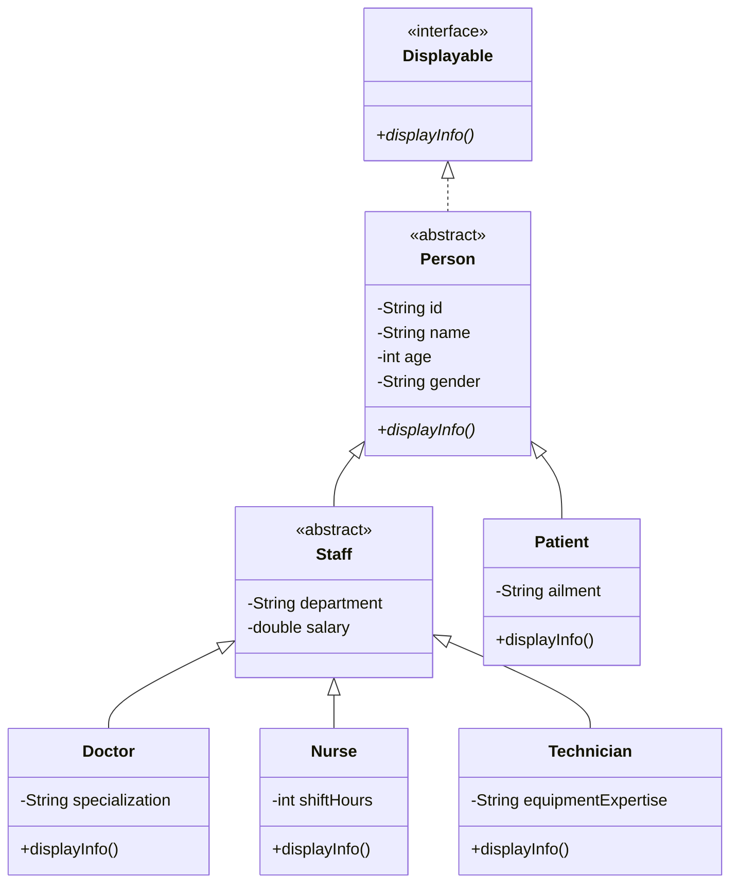
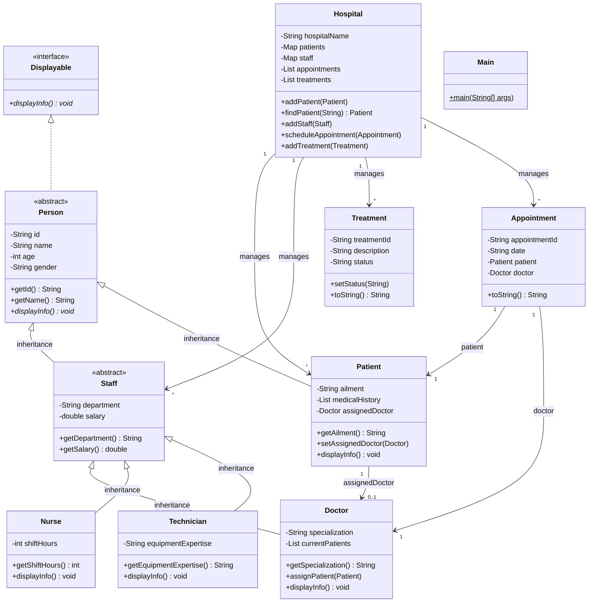

# Hospital Patient & Staff Management System
## Overview

The Hospital Patient & Staff Management System is a Java-based Object-Oriented Programming (OOP) project designed to manage hospital operations efficiently. The system provides functionalities for patient registration, doctor assignment, appointment scheduling, treatment management, and data persistence through file handling.

This project demonstrates core OOP concepts including Encapsulation, Inheritance, Abstraction, Polymorphism, Interfaces, and Java Collections Framework while solving a real-world hospital management problem.

---

## Objectives

- Manage patient records efficiently
- Register and manage hospital staff
- Assign doctors to patients
- Schedule appointments
- Track treatment progress
- Store and retrieve data using file handling
- Demonstrate Object-Oriented Programming concepts in a real-world application

---

## Features

### Patient Management
- Register new patients
- View patient information
- Search patients by ID
- Assign doctors to patients

### Staff Management
- Add doctors, nurses, and technicians
- Manage staff details
- Store department and specialization information

### Appointment Management
- Schedule appointments
- Associate patients with doctors
- View appointment details

### Treatment Management
- Create treatments
- Update treatment status
- Complete treatments
- Track treatment progress

### File Handling
- Save patient data to file
- Load patient data from file

---
- Group Project of OOP (2nd semester)
- Members Muhammad Abeer(25bscs109)
- Members Eman Tufail (25bscs154)


## Table of Contents

1. Overview
2. Objectives
3. Features
4. Project Structure
5. UML Diagrams
6. OOP Concepts
7. How to Run
8. Sample Output
9. Report
10. Authors
11. Acknowledgements
12. Future Enhancements

## 1. UML Class Diagrams

UML diagrams showing class structures, inheritance, relationships, attributes, and methods.

### 1.1 Inheritance Hierarchy

Shows how `Doctor`, `Nurse`, and `Technician` inherit from abstract classes `Staff` and `Person`.



**Text UML (inheritance):**

```
                ┌─────────────────────┐
                │     Displayable     │
                │     (Interface)     │
                └──────────┬──────────┘
                           │
                ┌──────────┴──────────┐
                │   Person (abstract) │
                │─────────────────────│
                │ - id                │
                │ - name              │
                │ - age               │
                │ - gender            │
                └──────────┬──────────┘
             ┌─────────────┴─────────────┐
             ▼                           ▼
  ┌───────────────────┐        ┌───────────────────┐
  │  Staff (abstract) │        │      Patient      │
  │───────────────────│        │───────────────────│
  │ - department      │        │ - ailment         │
  │ - salary          │        └───────────────────┘
  └──────────┬────────┘
     ┌───────┼───────┐
     ▼       ▼       ▼
┌────────┐┌───────┐┌──────────┐
│ Doctor ││ Nurse ││Technician│
└────────┘└───────┘└──────────┘
```

---

### 1.2 Complete Class Structure Diagram

Full diagram with all classes, attributes, methods, and relationships.



### 1.3 Relationships Summary

| Relationship | Description |
|--------------|-------------|
| **Inheritance** | `Staff` and `Patient` extend `Person`. `Doctor`, `Nurse`, `Technician` extend `Staff`. |
| **Aggregation** | `Hospital` holds maps and lists of patients, staff, treatments, appointments. |
| **Association** | `Patient` links to `Doctor` via `assignedDoctor` reference. |
| **Composition** | `Appointment` links a `Patient` and a `Doctor` for a specific date. |

### 1.4 System Overview (Text UML)

```
                    ┌──────────────┐
                    │     Main     │
                    └──────┬───────┘
                           │ uses
                           ▼
                    ┌──────────────┐
                    │   Hospital   │
                    └──────┬───────┘
           ┌───────────────┼───────────────┬──────────────┐
           ▼               ▼               ▼              ▼
    ┌──────────┐    ┌──────────┐    ┌───────────┐  ┌─────────────┐
    │ Patient  │    │   Staff  │    │ Treatment │  │ Appointment │
    └────┬─────┘    └────┬─────┘    └───────────┘  └─────────────┘
         │               │
         │ assigned to   │ extends (Doctor, Nurse, Technician)
         └───────────────┤
                         ▼
                  ┌──────────────┐
                  │ Person (abs) │
                  └──────┬───────┘
                         │
              ┌──────────┴──────────┐
              ▼                     ▼
       ┌──────────┐          ┌──────────┐
       │  Staff   │          │  Patient │
       └──────────┘          └──────────┘
```

---

## 2. Project Explanation

This system simulates a small hospital where you can:

- Add and view **patients** and **staff**
- Register **doctors**, **nurses**, and **technicians**
- **Assign** a doctor to a patient
- **Schedule** appointments
- **Create**, **update**, and **track** treatments
- Save and load data using **File Handling**
- See **polymorphism** in action through entity-specific `displayInfo()` methods

The program runs from a text menu in `Main.java`. Data is stored in memory using `ArrayList` and `HashMap`, and persisted in `patients_data.txt`.

### Project Structure

```
hospital-management-system/
│
├── README.md
├── Appointment.java
├── Displayable.java
├── Doctor.java
├── FileManager.java
├── Hospital.java
├── Main.java
├── Nurse.java
├── Patient.java
├── Person.java
├── Staff.java
├── Technician.java
└── Treatment.java
```

### How to Run

```bash
javac *.java OR java Main.java
java Main
```

**Requirements:** Java JDK 8 or higher.

---

## 3. Java Source Code

All source files are in the root folder. Below is a brief description of each class.

### Patient.java

Stores patient details. Extends `Person`.

| Attribute | Type |
|-----------|------|
| id, name, age, gender | inherited |
| ailment | String |
| assignedDoctor | Doctor |

**Key methods:** `displayInfo()` — prints patient information.

---

### Person.java (Abstract) & Displayable.java (Interface)

Base abstraction layer. `Displayable` ensures all entities can show their details. `Person` provides common fields like `id` and `name`.

---

### Staff.java (Abstract)

Base class for hospital staff. Adds `department` and `salary` to the `Person` class.

---

### Doctor.java, Nurse.java, Technician.java

Subclasses of `Staff` with role-specific attributes:
- **Doctor:** `specialization` and `currentPatients` list.
- **Nurse:** `shiftHours`.
- **Technician:** `equipmentExpertise`.

---

### Treatment.java & Appointment.java

- **Treatment:** Tracks medical procedures with statuses: `Pending`, `In Progress`, `Completed`.
- **Appointment:** Links a patient and a doctor on a specific date.

---

### Hospital.java & FileManager.java

- **Hospital:** Central manager using `HashMap` for fast ID lookup and `ArrayList` for ordered lists.
- **FileManager:** Handles saving and loading patient data to `patients_data.txt`.

---

## 4. Main.java (Entry Point)

`Main.java` provides the menu-driven interface.

### Menu Options

| Choice | Action |
|--------|--------|
| 1 | Add Patient |
| 2 | Add Doctor |
| 3 | Add Nurse / Technician |
| 4 | View Patients / Doctors |
| 5 | Assign Doctor to Patient |
| 6 | Create Treatment |
| 7 | Update Treatment Status |
| 8 | Schedule Appointment |
| 9 | Search Patient by ID |
| 10 | Save Data to File |
| 11 | Load Data from File |
| 0 | Exit |

---

## 5. Sample Output

Example console session:

```
Welcome to City General Hospital

--- HOSPITAL MANAGEMENT SYSTEM MENU ---
1. Add Patient
2. Add Doctor
3. Add Nurse / Technician
...
Choose an option: 1
Enter Patient ID: P101
Enter Name: Ahmed
Enter Age: 35
Enter Gender: Male
Enter Ailment: Fever
Patient added successfully!

Choose an option: 2
Enter Doctor ID: D1
Enter Name: Dr. Ali
...
Doctor added successfully!

Choose an option: 5
Enter Patient ID: P101
Enter Doctor ID: D1
Doctor assigned successfully!
```

---

## 6. Report

### 6.1 Project Overview

The **Hospital Patient & Staff Management System** is a Java console application designed for university-level OOP demonstration. It manages records for patients, medical staff, treatments, and appointments using efficient data structures.

### 6.2 OOP Concepts Used

| Concept | Where used |
|---------|------------|
| **Encapsulation** | Private fields with public getters/setters across all entity classes. |
| **Inheritance** | `Staff <|-- Doctor` and `Person <|-- Patient`. |
| **Polymorphism** | Overriding `displayInfo()` in subclasses. |
| **Abstraction** | `Person` and `Staff` as abstract classes; `Displayable` interface. |
| **Collections** | `ArrayList` for lists and `HashMap` for ID-based searching. |

### 6.3 Encapsulation

All sensitive data like `salary` or `ailment` is kept **private**. Access is provided via controlled methods, ensuring data cannot be corrupted by external classes.

### 6.4 Inheritance

`Person` serves as the root, containing basic info. `Staff` extends it with employment details, and specific roles like `Doctor` further extend `Staff`. This hierarchy avoids code duplication.

### 6.5 Polymorphism

The `displayInfo()` method behaves differently based on the object type. A list of `Staff` objects can contain doctors and nurses; calling `displayInfo()` on each will trigger the correct role-specific output.

### 6.6 Abstraction

We use **Abstract Classes** (`Person`, `Staff`) to define common structures without allowing direct instantiation. The **Interface** (`Displayable`) enforces a common behavior for all displayable entities.

### 6.7 Collections Used

- **ArrayList:** Used for `appointments` and `treatments` where order matters.
- **HashMap:** Used for `patients` and `staff` maps to allow O(1) time complexity for searches by ID.

### 6.8 Required Features Checklist

- [x] Add/View Patients
- [x] Manage Staff (Doctors, Nurses, Technicians)
- [x] Assign Doctor to Patient
- [x] Schedule Appointments
- [x] Track Treatments
- [x] File Handling (Save/Load)

### 6.9 Documentation

The code is documented with Javadoc-style comments explaining class responsibilities and method logic, following academic standards.

### 6.10 Conclusion

The project demonstrates a scalable approach to system design using Java. By separating concerns into distinct classes and leveraging inheritance, the system is easy to maintain and extend with future features like a GUI or database.

---


## 🧠 OOP Concepts Used

(Existing content)

---


## 🖥️ Technologies Used

| Technology | Purpose |
|------------|----------|
| Java | Core Programming |
| OOP | System Design |
| Scanner | User Input |
| ArrayList | Dynamic Data Storage |
| HashMap | Fast Record Searching |
| File Handling | Data Persistence |
| GitHub | Version Control |

---

## 🔗 CCP Requirement Mapping

| Requirement | Implementation |
|------------|----------------|
| Encapsulation | Private Fields |
| Inheritance | Person → Staff → Doctor, Nurse, Technician |
| Abstraction | Abstract Classes |
| Polymorphism | Method Overriding |
| Collections | ArrayList & HashMap |
| Treatment Management | Treatment Class |
| Appointment Scheduling | Appointment Class |
| Dynamic Interaction | Doctor ↔ Patient |

---

## Authors

### University OOP Assignment

- Muhammad Abeer (25BSCS109)
- Eman Tufail (25BSCS154)


## Project Information

| Project Title | Hospital Patient & Staff Management System |
|--------------|--------------------------------------------|
| Course | Object-Oriented Programming |
| Program | BS Computer Science |
| Faculty | Faculty of Computing and Emerging Technologies |
| Instructor | Engr. Shumail Zahra |
| Project Type | Complex Computing Problem (CCP) |
| Language | Java |
| Academic Session | Spring 2026 |

## Acknowledgements

We would like to express our sincere gratitude to our instructor, Engr. Shumail Zahra, for her guidance, valuable feedback, and continuous support throughout the development of this project. Her instructions and encouragement helped us understand and apply Object-Oriented Programming concepts in solving a real-world problem.

## License

This project is developed for academic and educational purposes only.
